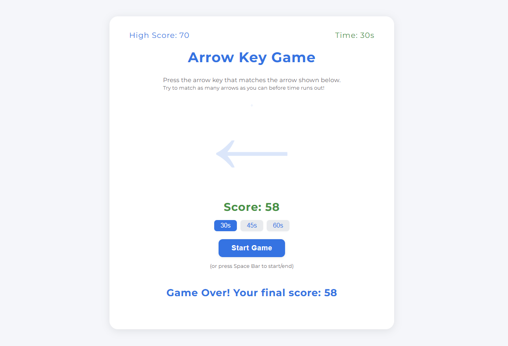

# Arrow Key Game

A fast-paced, minimal arrow key reaction game built with HTML, CSS, and JavaScript.

## Features

- **Three time modes:** 30s, 45s, 60s
- **Keyboard controls:** Play with arrow keys, select time with ←/→, start/end with Enter/Esc
- **Score & high scores:** Tracks your best score for each time mode
- **Modern UI:** Google-inspired, responsive, accessible, and professional
- **Instant feedback:** Seamless arrow display, penalty animation for mistakes

## How to Play

1. Select your desired time mode (use ←/→ or click)
2. Press **Enter** or click **Start** to begin
3. Press the matching arrow key as quickly as possible
4. Try to beat your high score before time runs out!
5. Press **Esc** or click **End** to finish early

## Accessibility & UX

- Fully keyboard accessible
- No tab focus on buttons for distraction-free play
- Responsive layout for all screen sizes

## Local Development

Just open `index.html` in your browser. No dependencies required.

---

**Made with ❤️ by faisalahmed11**
